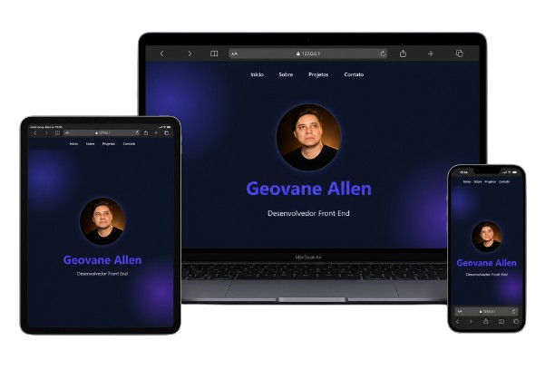

# 💼 Portfólio — Desenvolvedor Front-End

Landing page moderna e estratégica desenvolvida para apresentar minhas habilidades, projetos e capacidade de entregar soluções digitais com foco em performance e resultado.

---

## 📌 Visão Geral

Este projeto representa meu portfólio pessoal como desenvolvedor web Front-End, criado para demonstrar na prática:

* Qualidade de código
* Capacidade de design e UI
* Organização de projetos
* Pensamento estratégico voltado para conversão

Não é apenas um site visual, é uma vitrine profissional orientada a gerar oportunidades.

---

## 🎯 Objetivo

* Consolidar minha presença profissional online
* Demonstrar projetos reais desenvolvidos
* Atrair recrutadores e clientes
* Servir como prova prática das minhas habilidades técnicas

---

## 🧠 Estrutura da Landing Page

A página foi construída seguindo uma lógica estratégica de apresentação:

* Hero Section → Apresentação direta e proposta de valor
* Sobre mim → Posicionamento profissional
* Projetos → Portfólio com aplicações reais
* Contato → Canal direto para oportunidades

---

## 🛠️ Tecnologias Utilizadas

* HTML5 → Estrutura semântica e acessível
* CSS3 → Estilização moderna, responsiva e animada
* JavaScript → Interatividade e dinamismo

---

## ⚙️ Funcionalidades

* Navegação suave entre seções
* Animações ao scroll
* Layout responsivo
* Seção de projetos com foco em apresentação visual
* Interface moderna com foco em experiência do usuário

---

## 📱 Responsividade

Totalmente adaptado para:

* Dispositivos móveis
* Tablets
* Desktops

## 📸 Preview

---

## 🔗 Deploy

Acesse o projeto online:

https://geovane-allen.netlify.app/

---

## 📈 Estratégia Aplicada

O portfólio foi pensado para ir além do visual:

* Estrutura clara e objetiva
* Comunicação direta (sem ruído)
* Destaque para projetos relevantes
* Navegação simples e fluida
* Foco em causar boa primeira impressão em poucos segundos

---

## 💼 Projetos em Destaque

Alguns dos projetos apresentados incluem:

* Landing pages para negócios locais
* Sites institucionais
* Projetos focados em conversão
* Interfaces modernas e responsivas

---

## 🔧 Melhorias Futuras

* Integração com backend para formulário de contato
* SEO avançado
* Otimização de performance (Lighthouse)
* Implementação de dark/light mode
* Versão com React ou framework moderno
* Inclusão das tecnologias dominantes

---

## 👨‍💻 Autor

# Geovane Allen

💼 LinkedIn: https://www.linkedin.com/in/geovaneallen/
 
🌐 Portfólio: https://geovane-allen.netlify.app/
 
📱 Contato: https://wa.me/5585991986569

---

## 📄 Licença

* Este projeto está sob a licença MIT.